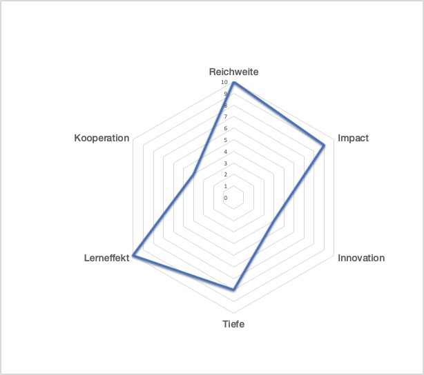

# Psychiatrie
 Abschlussarbeit von Jörg Niggli, CAS Datenjournalismus 2019/2020

### Die publizierten Beiträge und Artikel

[SRF «Puls», 17.2.2020](link)

[SRF «Tagesschau 19:30», 17.2.2020](Link)

[srf.ch, Online-Artikel 1](Link)

[srf.ch, Online-Artikel 2](Link)

[Tageschau 13:00, 17.2.2020](link)

[Radio SRF 1, 17.2.2020](link)

### Ausgangsthese
Trotz weltweit höchster Psychiatriedichte «importiert» die Schweiz weiterhin viele Psychiaterinnen und Psychiater aus dem Ausland, mit dem Problem, dass viele davon das wichtigste Behandlungsinstrument, die Sprache, nur teilweise beherrschen. Besonders Institutionen, die schwere Fälle behandeln, müssen vermehrt auf Ärzte zurückgreifen, die auch aus nicht-deutschsprachigen Ländern kommen. 

### Einschätzung von Aufwand und Ertrag (zu Beginn)
Es war mir von Beginn weg klar, dass dies ein umfangreiches und potentiell ausuferndes Projekt werden kann. Das BAG lehnte es ab, die MedReg-Daten komplett als anonymisiertes Datenfile bereit zu stellen. Deshalb entschied ich mich für ein Scraping der gesamten Datenbank. Ich würde so einerseits über die aktuellsten Daten bis Ende 2019 verfügen sowie auch personenbezogene Auswertungen vornehmen können. Ein gezieltes Scraping z.B. nur der Ärzteschaft erwies sich als nicht möglich. 
Das bedeutete für mich als Phyton-Frischling, das der zeitliche Aufwand nur schwer abzuschätzen war. Einerseits musste ich einen funktionierenden Scraper bauen und andererseits die grossen Datenmengen auch noch korrekt parsen, das heisst in eine verwertbare Form überführen. 
Ich entscheid mich aus zwei Gründen trotzdem für das Vorhaben:
1. Knowhow-Aufbau: Scraping, Parsing und Pandas in der praktischen Anwendung. Und die Möglichkeit die gewonnen Daten und die vertieften Programmierkenntnisse allenfalls für spätere Projekte zu verwenden. 
2. Journalistischer Impact: Das Thema schwebt mir seit Jahren im Hinterkopf. Die aktuellen Daten und die Möglichkeit, diese nach eigenen Kriterien auszuwerten, würden es mir erlauben, einen eigenen Aufhänger für die Publikation der Story zu schaffen und damit auch strukturelle Mängel in der psychiatrischen Versorgung der Schweiz zu thematisieren.

### Knackpunkte
- Schwierige Fokussierung auf einen Teilaspekt
- wie lässt sich der Aspekt der Fehlversorgung (viele Psychiater, aber nicht am richtigen Ort) mit Daten belegen, bzw. überhaupt thematisieren?
- Gerade Kliniken arbeiten viele Ärzte im psychiatrischen Bereich, die den Facharzttitel noch nicht erhalten haben oder evtl. auch gar nicht anstreben. Wie komme ich da an die richtigen Zahlen?

### Briefing-Personen

**Briefing Person 1: Thomas Ihde**
Chefarzt Psychiatriestation Spital FMI (Berner Oberland) sowie Präsident der Patientenorganisation Pro Mente Sana 
	- Fremdsprachige Psychiater: ja, relativ häufiges Problem. immer wieder auch von Patienten angesprochen. Selbst bei deutschen Ärzten ein Problem, da nicht alle Dialekt sprechen bzw. gut verstehen. 
	- Beurteilung, ob jemand psychotisch ist oder nicht: äusserst heikel, wenn jemand Sprache nicht gut versteht oder spricht
	- wegen der grossen Nachfrage arbeiten gewisse Ärzte in der Psychiatrie, die eigentlich eine andere Fachrichtung bevorzugen würden
	- Eigentlich kein Mangel (wie vom Psychiatrieverband SGPP behauptet), sondern eine Fehlversorgung, da regional sehr unterschiedlich: in urbanen Zentren viele, auf dem Land zu wenige, in eigenen Praxen viele, in Klinken zu wenige. Andere Länder sind viel weniger ärztezentriert sondern breiter aufgestellt, wo auch Psychologinnen oder Pflegefachpersonen Funktionen übernehmen, die in Schweizer Kliniken (Assistenz-)Ärzte innehaben.

**Briefing Person 2; Angela Brucher**
Chefärztin Psychiatrie-Dienste Süd des Kantons St. Gallen, einer Klinik mit einem hohen Anteil an Ärzten, die aus Nicht-EU-Staaten stammen, die meisten davon aus Serbien (7)
	- Bei Stelleninseraten für Psychiaterstellen, wenig bis gar keine Anmeldungen. Ärzte finden sich in Osteuropa und auch im arabischen Raum. Das bedeutet mehr Aufwand, auch für die sprachliche Integration. 
	- Es kommt zu schwierigen Situationen, wenn Patienten nur Dialekt sprechen. Vorteil: auch für ausländische Patienten ist manchmal jemand in der Muttersprache verfügbar.
	- Gründe für das mangelnde Interesse der Schweizer Ärztinnen und Ärzte: zu wenig Ärzte überhaupt in der Schweiz, durch Zulassungsbeschränkung. Prestige ist nicht so hoch, Facharzt mit 6 Jahren lang und Löhne im Vergleich relativ tief.
	- In der Klinik bleiben viele Ärztinnen und Ärzte am wenigsten. Die Arbeitsbedingungen sind mit Notfall- und Nachtdiensten stressiger. Ambulatorien sind beliebter. Viele ausgebildeten Psychiater lassen sich später auch in eigener Praxis nieder. 

### Die Datenquellen
Obschon das Gesundheitswesen einen wachsenden Brocken unserer Volkswirtschaft darstellt (rund 12% des BIP) und die Kosten jährlich mehr steigen als die Teuerung, gibt es dazu in vielen Bereichen nur unzureichende oder sogar widersprüchliche Daten. Das ist leider auch bei den Ärzten nicht anders. Das fängt schon bei der Zahl an, wie viele Ärztinnen und Ärzte in welchem Bereich, in welchem Umfang berufstätig sind. 

Für die Datenrecherche zu den Psychiaterinnen und Psychiatern wertete ich hauptsächlich zwei Quellen aus, um daraus ein Bild über den Umfang und die Entwicklung zu gewinnen.

**1. Das Medizinalberuferegister [MedReg](https://www.medregom.admin.ch/DE)**

Im MedReg waren per Ende 2019 insgesamt 5413 Personen registriert, die über einen Facharzttitel «Psychiaterie und Psychotherapie» verfügen. Aus diesem Datenpool wurde ausgewertet, in welchem Land diese Psychiaterinnen und Psychiater ihr Medizinstudium (Arztdiplom) absolviert haben. 
Keine genaue Aussage erlaubt das MedReg hingegen darüber, wie viele dieser registrierten Ärztinnen und Ärzte tatsächlich berufstätig sind. 4415 der 5413 Personen mit anerkanntem Psychiatrie-Facharzttitel verfügten per Ende Jahr gemäss dem Register über eine erteilte Berufsausübungsbewilligung. Allerdings hiess es beim BAG Nachfrage, dass Ärzte auch ohne eine solche Bewilligung tätig sein können, wenn auch nicht in eigener fachlicher Verantwortung. 
Die Ärztegesellschaft FMH kommt in ihrer [Statistik](https://www.fmh.ch/themen/aerztestatistik/fmh-aerztestatistik.cfm#i131905)
für 2018 insgesamt auf 3814 Psychiater.  Gemäss dem Gesundheitsobservatorium [Obsan](https://www.bag.admin.ch/dam/bag/de/dokumente/berufe-gesundheitswesen/medizinalberufe/plattform-zukunft-aerztliche-bildung/Bericht%20Obsan_Ermittlung%20des%20zuk%C3%BCnftigen%20Bestands%20und%20Bedarfs%20an%20%C3%84rztinnen%20und%20%C3%84rzten%20nach%20Fachgebiet_Erstes%20Berechnungsmodell.pdf.download.pdf/Bericht%20Obsan_Ermittlung%20des%20zuk%C3%BCnftigen%20Bestands%20und%20Bedarfs%20an%20%C3%84rztinnen%20und%20%C3%84rzten%20nach%20Fachgebiet_Erstes%20Berechnungsmodell.pdf) hat auch diese Statistik Mängel: «Die FMH-Ärztestatistik erfasst gemäss Schätzung ca. 95% der Ärztinnen und Ärzte in der Schweiz. Sie weist insbesondere bei den Assistenzärztinnen und -ärzten sowie den ausländischen Ärztinnen und Ärzten noch Lücken auf.»
Da es bei meiner Recherche nicht um die Anzahl der berufstätigen Psychiaterinnen und Psychiatern sondern um ein Bild über die Herkunft der Ärzte und die Entwicklung des Zustroms ausländischer Fachkräfte ging, erlaubten die MedReg-Daten diesbezüglich die besten Aussagen. Sie werden auch vom Obsan für solche Auswertungen herangezogen. 
Alle durchgeführten Analysen mit den MedReg-Daten sind retrospektiv. Das MedReg ist ein Register, dem laufend Daten neu hinzufügt oder gelöscht werden (wenn zum Beispiel eine Personen verstirbt oder wieder auswandert). Dennoch ergaben Quervergleiche meiner Resultate mit Datensätzen des BAG und des BFS aus den Vorjahren nur geringe Abweichungen (bis ca. 1% pro Jahr), die mit Mutationen in der Zwischenzeit zu erklären sind. 

**2. [Weiterbildungsstatistik des SIWF]( https://www.siwf.ch/themen/statistik.cfm)**

Ein weitere Analyse erfolgte mit den Daten des Instituts für medizinische Weiter- und Fortbildung SIWF. Sie erlauben einen Blick in die Kliniken und Ambulatorien, wo Assistenzärzte einen grossen Teil der Arbeit an der Front erledigen. Zudem konnte ich diese Daten auch nach regionalen Gesichtspunkten auswerten: welche Kliniken müssen in welchem Masse auf ausländische Ärztinnen und Ärzte setzen, und woher kommen diese (EU oder Nicht-EU)?
Diese Zahlen lagen im Januar für das Jahr 2019 bereits vor. Sie werden von den Kliniken direkt dem SIWF gemeldet. 

### Arbeitsprotokoll
**Bitte festhalten: Python-Anfänger und TV-Produktion!**

Der Aufwand für die Beschaffung und Auswertung der Daten lag deutlich höher als ursprünglich erwartet, obschon ich letztendlich auf einige Auswertungen verzichtete. Andererseits habe ich mich sehenden Auges in diese Aufgabe gestürzt, auch um das alles mal durchzuziehen und den maximalen Lerneffekt zu haben. Als Python-Anfänger verbringt man schnell einmal Stunden beim Coden, ohne am Schluss viel weiter zu sein. 

Sehr aufwändig war bereits das Scraping. Nach viel Vorarbeit in der ersten Phase (2019) dachte ich ja, der Code läuft, alle Daten sind da. Erst bei den ersten Analysen (Anfang 2020)  bemerkte ich, dass die Error 500-Dateien nicht alles leere IDs waren, wie ursprünglich angenommen, sondern zum Teil auch valide, aber vom Scraper übersprungene Datensätze. So erweiterte ich den Code im Januar und führte das Scraping erneut durch. 

Auch das Parsing der html-Datensätze mit BeautifulSoup war schwieriger und zeitintensiver als nach den ersten erfolgreichen Testläufen vermutet. Erst bei der Datenanalyse mit Pandas bemerkte ich Fehlzuordnungen, die ich bereinigen musste. Entsprechend verunsichert war ich deshalb über die Qualität der Resultate, zumal diese noch deutlicher (im Sinne der These) ausfielen, als erwartet. 
Deshalb floss noch einiges an Arbeits- bzw. Freizeit in den Plausibilätscheck der Daten. Flott hingegen lief die Analyse der im Januar aufgestöberten SIWF-Daten zu den Assistenzärzten, die ich dank Pandas zügig bearbeiten konnte. 

Bei einer ähnlichen Recherche, evtl. sogar mit denselben Datensätzen, kann ich auf diese Vorarbeit zurückgreifen. Als normales Projekt hätte ich aber den Stecker viel früher ziehen müssen. Ein solcher Aufwand liegt notmalerweise nicht drin, zumal die Hauptaussage auch mit bereits vorhandenen Datensätzen gestützt gewesen wäre, wenn auch nicht in dieser Qualität und Aktualität, die nur dank dem Scraping möglich war. 

Gerne hätte ich noch weitere Auswertungen der MedReg-Daten vorgenommen, vor allem ein Vergleich der Entwicklung über verschiedene Facharztgruppen hinweg und eine Analyse der MedReg-Daten bezogen auf die Kantone oder Regionen mit Geopandas. Doch nach den Erfahrungen beim aufwändigen Parsen und Bereinigen der Psychiatrie-Daten musste ich darauf verzichten. Zudem erlauben diesbezüglich auch die Daten zu den Assistenzärzten Aussagen über die Fachrichtungen und unterschiedliche Versorgung der Regionen. 

Im TV ist ja normalerweise die Recherche 10-30% des gesamten Arbeitsaufwands, der Rest ist Organisation, Dreh, Schnitt und Postproduction. Hier war's mal fast umgekehrt, trotz über 15 Beitragsminuten, alleine bei «Puls». 

**1\. Phase: Scraper entwickeln**

| Datum                        | Was                                                                                                   | Aufwand |
|------------------------------|-------------------------------------------------------------------------------------------------------|
| 15\.10\.2019                 | Grundrecherche: Berichte, Artikel, Datenquellen explorieren                                           | 8       |
| 18\.10\.2019                 | Erste Datenanalysen mit MedReg\-Rohdaten BAG \(Excel\), Code für Scraper von PsyReg                   | 6       |
| 24\.10\.2019                 | Code entwickeln für Scraper PsyReg, Testlauf                                                          | 8       |
| 27\.10\.2019                 | Scraping PsyReg \(7’100 json\-Files\)                                                                 | 3       |
| 31\.10\.2019                 | Code entwickeln für Scraper MedReg                                                                    | 2       |
| 5\.11\.2019                  | Scraping MedReg, Testläufe, Code anpassen wegen Blockierung durch Server                              | 5       |
| 7\.11\.2019                  | Scraping MedReg, Tag 1                                                                                | 2       |
| 8\.11\.2019                  | Scraping MedReg, Tag 2                                                                                | 2       |
| 9\.11\.2019                  | Scraping MedReg, abgeschlossen \(149’000 html\-Files\)                                                | 2       |
| 10\.11\.2019                 | Parsing Code entwickeln für PsyReg Daten                                                              | 2       |
| 12\.11\.2019                 | Parsing Code entwickeln für PsyReg Daten \(nicht weiterverfolgt, da Konzentration auf MedReg\-Daten\) | 3       |
| 17\.11\.2019                 | Parsing Code entwickeln für MedReg\-Daten                                                             | 4       |
| 20\.12\.2019                 | Tel\. Briefing Personen Angela Brucher, Thomas Ihde, Dokumentation                                    | 2       |
|          | TOTAL erste Phase     |    49                                                                                              |	

**2\. Phase: MedReg Re\-Scraping, Parsing, Auswertung, Umsetzung**

| Datum                                                         | Was                                                                                                   | Aufwand |
|--------------------|--------------------------------------------------------------------------------------|----|
| 3\.1\.2020         | Grobe Auswertung der Daten aus dem MedReg\-Scraping 2019                             | 2  |
| 11\.1\.2020        | Erneutes Scraping des MedReg \(während 2 Tage\), erste Checks                        | 8  |
| 13\.1\.2020        | Re\-Scraping MedReg fehlender Datensätze                                             | 2  |
| 14\.1\.2020        | Code für Scraping anpassen, da weitere Fehler entdeckt                               | 2  |
| 15\.1\.2020        | Erneutes Scraping MedReg, SIWF\-Daten analyisieren, Telefone, Suche nach Betroffenen | 8  |
| 16\.1\.2020        | Scraping MedReg, SIWF\-Daten auswerten, Telefonische Recherche                       | 6  |
| 17\.1\.2020        | Recherche Betroffene, Tel\. mit Experten                                             | 3  |
| 18\.1\.2020        | Datencheck MedReg, Code anpassen für erneutes Re\-Scraping von Code500\-Files        | 2  |
| 19\.1\.2020        | Nach\-Scraping MedReg \(8300 Files\), erste Analysen                                 | 8  |
| 20\.1\.2020        | MedReg Parsing Code verfeinern, Telefone, Dreh Konzept Beitrag 2                     | 7  |
| 21\.1\.2020        | VJ\-Dreh Psychiatrie Interlaken, MedReg Parsing Code                                 | 12 |
| 22\.1\.2020        | VJ\-Dreh Psychiatrie Interlaken                                                      | 6  |
| 23\.1\.2020        | Recherche Betroffene, MedReg Parsing\-Code endlich erstellt                          | 4  |
| 24\.1\.2020        | Ablaufkonzept Beiträge und Studio, MedReg Daten bereinigen                           | 4  |
| 25\.1\.2020        | MedReg Datenanalyse nach verschiedenen Kritierien                                    | 2  |
| 26\.1\.2020        | MedReg Datenanalyse nach verschiedenen Kriterien, Gegenchecks                        | 6  |
| 29\.1\.2020        | MedReg Datenanalyse, Check, Vorbereitung Dreh SG\-Süd                                | 6  |
| 30\.1\.2020        | Dreh Psychiatrie SG\-Süd                                                             | 9  |
| 31\.1\.2020        | MedReg Datencheck, Telefone Psychiatrie, Betroffene, Briefing Moderation             | 5  |
| 1\.2\.2020         | MedReg, Datenanalyse, Check                                                          | 2  |
| 2\.2\.2020         | MedReg, Datenanalyse, Konzept                                                        | 4  |
| 3\.2\.2020         | Schnittvorbereitung, Koordination / Aufbereitung Datenanalysen                       | 6  |
| 4\.2\.2020         | Schnittvorbereitung, Recherche Betroffene, FSP usw\.                                 | 6  |
| 5\.2\.2020         | Konzept Grafik, VJ\-Dreh Reax VASK, Rohschnitt Interlaken, MedReg Datencheck         | 10 |
| 6\.2\.2020         | Schnitt Beitrag 2 Interlaken                                                         | 5  |
| 7\.2\.2020         | Datencheck mit Obsan, VJ\-Dreh Patient, FSP                                          | 7  |
| 9\.2\.2020         | Konzept Beitrag 1, Grafiken, Kontakt Studiogast                                      | 8  |
| 10\.2\.2020        | Telefon Studiogast, VJ\-Dreh Patientin in SG                                         | 10 |
| 11\.2\.2020        | Tel\. Politik, Verband, Archivmaterial, Grafik, Visionieren und Rohcut               | 12 |
| 12\.2\.2020        | Schnitt Beitrag 1                                                                    | 8  |
| 13\.2\.2020        | Schnitt Beitrag 1 und Beitrag Tagesschau, Koordination mit TS                        | 8  |
| 14\.2\.2020        | 2 Online Artikel, Kasten, Koordination Online, Moderation, Beitragstext              | 10 |
| 16\.2\.2020        | Online\-Texte redigieren, Input für Moderationem                                     | 3  |
| 17\.2\.2020        | Beiträge vertonen, Interview für Tagesschau und Radio SRF1                           | 8  |
|  | Total zweite Phase | 209                                                                                  |
